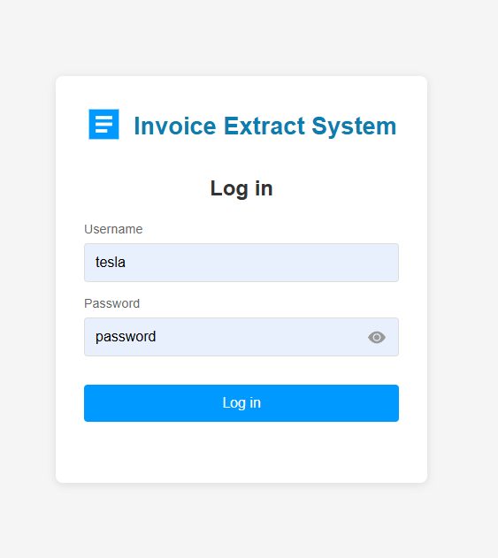
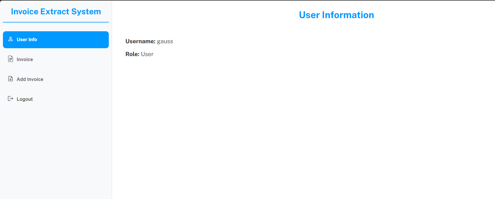
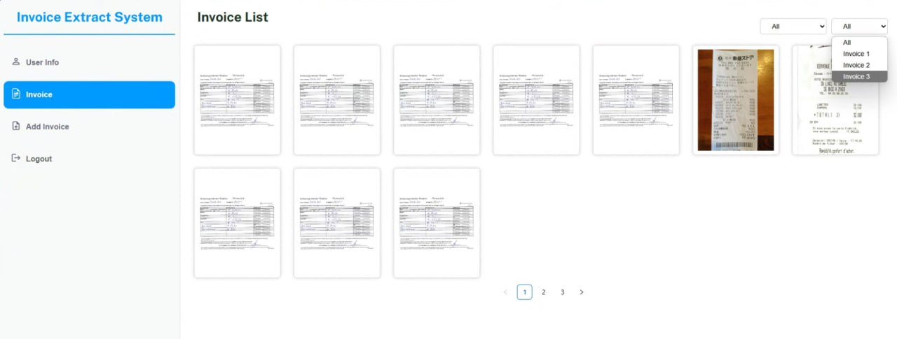
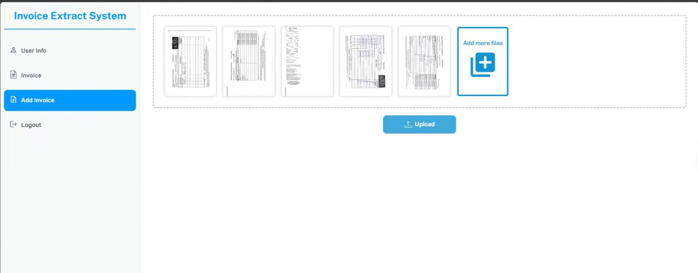
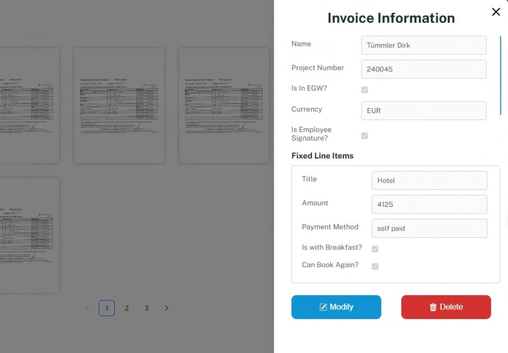

# Invoice Information Extractor

## Table of Contents
1. [Introduction](#introduction)
2. [Features](#features)
2. [Screenshots](#screenshots)

---

## Introduction

The **Invoice Information Extractor** is a user-friendly web application designed for businesses and individuals who frequently handle invoices and need an automated tool to extract, organize, and manage invoice data. By leveraging Optical Character Recognition (OCR) and natural language processing (NLP) techniques, this tool allows users to easily upload invoices in the form of images or PDF files and automatically extract relevant data, such as vendor names, dates, amounts, and more.

Built with **Reactjs** and **Python**, the application offers a clean and interactive interface that enables users to view, modify, and delete invoice information. Extracted data can be displayed in both JSON and table formats, making it easy for users to verify and work with the data. Additionally, the tool offers the functionality to generate reports and send them via email.

---

## Features

- **Login using LDAP Authentication**: Secure login process that integrates with LDAP, ensuring only authorized users have access to the tool.
  
- **Upload Functionality**: Supports uploading both single and multiple files, including image formats (JPEG, PNG, etc.) and PDF files. Users can upload multiple invoices for batch processing.

- **Data Extraction**: Automatically extracts key invoice information such as:
  - Vendor/Client names
  - Invoice dates
  - Invoice amounts
  - Due dates
  - Invoice numbers

- **Structured Data Display**:
  - **JSON format**: View the raw extracted data in a structured JSON format.
  - **Table format**: A more user-friendly tabular format for quick review and edits.

- **Website for Invoice Management**: A built-in web interface allows users to:
  - Interact with uploaded invoices
  - Modify extracted information
  - Delete invoices from the system

- **Automated Report Generation**:
  - Generate and export reports from the extracted invoice data, summarizing key metrics such as total amounts due, payment deadlines, and more.

- **Email Report Delivery**: Automatically send the generated report via email, making it easier for users to share invoice summaries with relevant stakeholders.

### Screenshots

- **Login Screen**:
  

- **User Information**:
  

- **Invoice List**:
  

- **Upload Invoice**:
  

- **Invoice Information and Modification**:
  


Here’s the rewritten document in Markdown:

## Get Started

If you want to build using Docker Compose on EC2, please refer to this document: [docs/set_up_EC2.md](docs/set_up_EC2.md). Essentially, you just need to:

1. Clone the code.
2. Set up the `.env` file.
3. Run:
   ```bash
   docker-compose up -d
   ```

If you'd prefer to custom build each part using Docker, please refer to this document: [docs/custom_build.md](docs/custom_build.md).

For more information, check the following documents in the [docs](docs) folder:

- [Invoice Info Format](docs/invoice_info.md)
- [RESTful APIs](docs/restful_api.md)
- [Architecture](docs/architecture.md)


