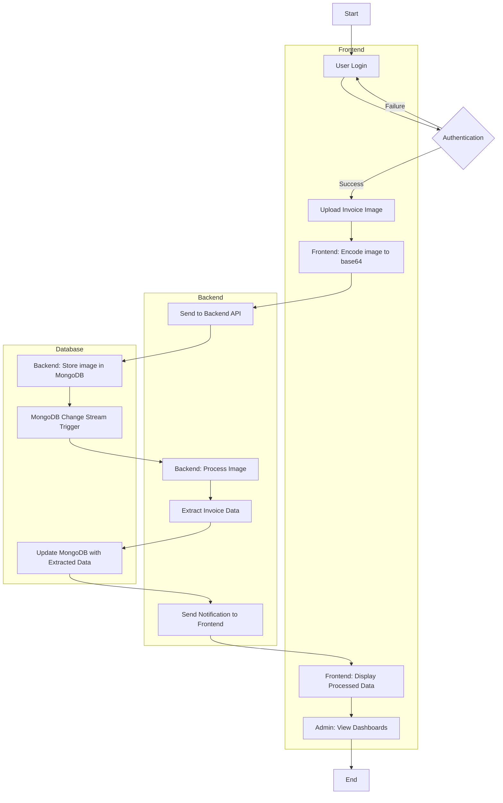

Here's a summary of the architecture for your invoice extraction system:

### **System Overview**
The system consists of three primary components: 
1. **Frontend (React Native)**
2. **Backend (Python with FastAPI)**
3. **Database (MongoDB)**

Each component has specific responsibilities to ensure the smooth operation of the system.

### **1. Frontend (React Native)**
**Responsibilities:**
- **User Interface & Interaction:**
  - Provides an interface for employees to log in, upload invoice images, and view processed data.
  - Allows admin users to access dashboards to monitor system activity, such as the number of processed invoices, traffic, and other metrics.
  
- **Image Processing (Client-Side):**
  - Handles client-side image processing tasks like rotation, zoom, and preview before uploading.
  
- **Data Submission:**
  - Submits invoice images to the backend by encoding them into base64 format.
  - Handles user authentication, managing user sessions securely.

- **Real-Time Updates:**
  - Receives notifications about the status of image processing (e.g., upload success, processing success) and updates the UI accordingly.

### **2. Backend (Python with FastAPI)**
**Responsibilities:**
- **API Endpoints:**
  - Provides RESTful endpoints for handling image uploads, user authentication, and fetching processed invoice data.
  - Exposes endpoints for CRUD operations on images, such as uploading, deleting, and updating invoice images.

- **Image Processing:**
  - Once images are uploaded and stored in MongoDB, the backend listens for changes using MongoDB change streams.
  - Asynchronously processes the images to extract invoice details (e.g., invoice number, date, total amount).
  
- **Asynchronous Processing:**
  - Uses asynchronous programming to handle multiple image processing tasks concurrently, ensuring the system remains responsive.
  
- **Notification System:**
  - Sends real-time notifications to the frontend about the status of image processing (upload success, processing completion).
  
- **User Authentication & Authorization:**
  - Manages secure user authentication and authorization, ensuring that only authorized users can access specific features (e.g., admin dashboards).

### **3. Database (MongoDB)**
**Responsibilities:**
- **Data Storage:**
  - Stores user data (e.g., login credentials), invoice images (in base64 format), and extracted invoice information.
  - Manages collections for `users` and `invoices`.

- **Change Streams for Processing Triggers:**
  - Uses MongoDB's change streams to detect when new invoice images are uploaded. This triggers the backend to begin processing the images.
  
- **Data Update & Management:**
  - Stores the results of the image processing in the `invoices` collection, including the extracted invoice details and processing status.
  
- **CRUD Operations:**
  - Facilitates efficient CRUD operations (Create, Read, Update, Delete) on both user data and invoice records.

### **System Workflow**
1. **User Login**:
   - Employees and admins log in via the React Native frontend. The credentials are validated by the FastAPI backend using data stored in MongoDB.
  
2. **Image Upload**:
   - Employees upload invoice images through the frontend. The images are encoded in base64 and sent to the backend via an API call.
  
3. **Data Storage & Trigger**:
   - The backend stores the image data in MongoDB. MongoDB’s change stream detects the new image and triggers the backend to start processing.
  
4. **Invoice Processing**:
   - The backend processes the image asynchronously, extracting relevant invoice data.
   - Once processing is complete, the backend updates the MongoDB document with the extracted data.
  
5. **Notification**:
   - The backend sends real-time notifications to the frontend about the status of the processing.
  
6. **Data Display**:
   - The processed invoice data is retrieved and displayed on the frontend. Admins can view aggregated data through dashboards.

### **Summary**
- **Frontend (React Native)**: User interface, image manipulation, and interaction management.
- **Backend (FastAPI)**: API management, image processing, user authentication, and real-time communication.
- **Database (MongoDB)**: Data storage, triggers for processing, and managing user and invoice information.

